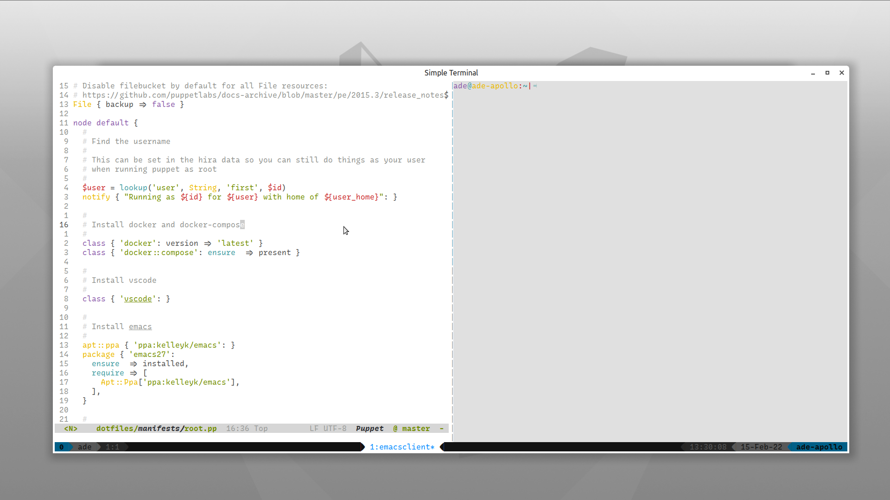

<div align="center">

# Dotfiles EST 2015

Personal system configuration

</div>



This is my over complicated system configuation managed with
[Puppet](https://puppet.com/), containing all the usual tools you would expect
from a terminal development workflow.

# Prerequisites

Before you consider using this configuration, it is recommended that you have
your own repository and you just take what you need from this repository and
adapt it to your needs. If you really want *this* configuration then it is
recommended that you fork, review the code and remove anything you don't need.

To install the configuration Puppet Bolt and Git are required to on the system
so you can run the install scripts.

- [Git](https://git-scm.com/book/en/v2/Getting-Started-Installing-Git)
- [Puppet Bolt](https://puppet.com/docs/bolt/latest/bolt_installing.html)

# Install 

**NOTE:** Currently the only OS supported is [Ubuntu
MATE](https://ubuntu-mate.org/), up until 2020 [Ubuntu
Desktop](https://ubuntu.com/desktop) was used at work so that should have good
support but really any Debian system should be OK.

```bash
# Clone the repo
git clone https://gitlab.com/adeattwood/dotfiles.git ~/.dotfiles
# Apply the configuration
site-modules/core/files/bin/dotfiles apply
```
